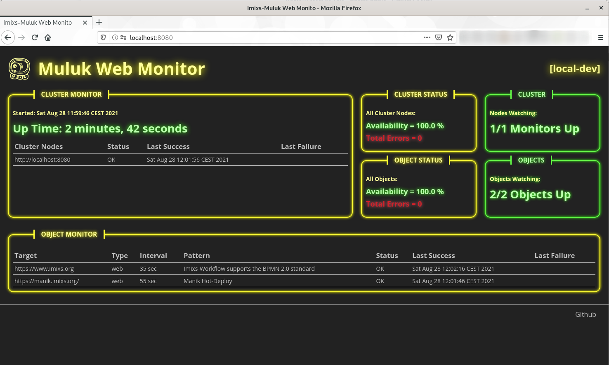

# Muluk-Monintor

Muluk is a super simple to use WebService Monitor. Muluk watches your web services and applications and notifies you if something went wrong. It is independent form any other service, needs no database and no painful installation. You simply start with docker and one single configuration file.
Of course, you can run Muluk also in a cluster to ensure a high reliability of your monitoring solution. 

## Web Frontend 

Muluk provides a Web front-end and a Rest API: 

 

## Notification & Alerting

Muluk automatically notifies you via E-Mail if one of your services or monitors goes down. In addition Muluk sends out a daily morning E-Mail just to tell you that everything is fine. 

# How to Start

Muluk is hosted on Docker-Hub. So you simply can start Muluk with Docker: 

	$ docker run \
	  -e TZ="CET" \
	  -e LANG="en_US.UTF-8" \
	  -v $PWD/config.xml:/opt/jboss/config.xml \
	  -p "8080:8080" \
	  imixs/muluk:latest

## The Configuration

All you need is a configuration file defining your cluster and the targets to monitor.    

	<muluk-dev>
	  <cluster name="local-dev">
	    <node>
	      <target>http://localhost:8080</target>
	      <auth type="BASIC" user="admin" password="adminadmin" />
	    </node>
	  </cluster>
	  <!-- Enable this section to receive E-Mail notifications
	  <mail host="mail.foo.com" port="465" user="your-user" password="your-password" from="info@foo.com">
	    <recipients>info@foo.com</recipients>
	  </mail>
	  -->
			
	  <!-- The Objects to Monitor -->
	  <monitor>
	    <object type="web" >
	      <target>https://www.imixs.org</target>
	      <pattern>Imixs-Workflow </pattern>
	    </object>
	    <object type="web">
	      <target>https://foo.com/</target>
	      <pattern>my-data</pattern>
	      <auth type="basic">
	        <user>yyy</user>
	        <password>xxx</password>
	      </auth>
	    </object>
	  </monitor>	       
	</muluk-def>
    
    
### The Object Configuration

Each object to be monitored is defined by an Object Configuraiton inside the *config.xml* file. An Object defines the target URL and a pattern to match the content. Also you can define optional authentication settings to monitor secured web services and applications.

	<object type="web">
		<target>https://foo.com/</target>
		<pattern>my-data</pattern>
	    <auth type="basic">
	       <user>yyy</user>
	       <password>xxx</password>
	    </auth>
	</object>

| Element     | Description                                           | Example               |
|-------------|-------------------------------------------------------|-----------------------|
| target      | the URL to be monitored                               | https://www.foo.com   |
| pattern     | a string or a regular expression to test the content  | 'hello world'         |
| auth        | optional authentication object. The type attribute defines the authentication method (basic,form,jwt)       | basic                 | 
| user        | the UserId used for authentication (only for type 'basic' and 'form')   | my-userid             | 
| password    | the password used for authentication or a valid jwt token            |                       | 

### The Mail Configuration

Muluk is automatically sending notifications and alerts via E-Mail if one of your services or monitors goes down. You can define the mail server in the *config.xml* file in the section <mail>

	<mail host="mail.foo.com" port="465" user="your-user" password="your-password" from="info@foo.com">
	   <recipients>info@foo.com,admin@foo.com</recipients>
	</mail>

| Element     | Description                                             |
|-------------|---------------------------------------------------------|
| host        | host name of you mail sever                             |
| port        | imap port (default 465)                                 |
| user        | imap mail user for authentication                       |
| password    | imap password for authentication                        |
| recipients  | comma separated list of mail recipients                 |

## Security

The Web interface is protected with a BASIC authentication security realm. You can use the default user 'admin' with the default password 'adminadmin'.

To change the user/password you simply need to create/edit the files '*muluk-users.properties*' and '*muluk-roles.properties*' and map these files into your docker container.

The files '*muluk-users.properties*' contains the user and password for authentication.

	$ docker run \
	  -e TZ="CET" \
	  -e LANG="en_US.UTF-8" \
	  -v $PWD/config.xml:/opt/jboss/config.xml \
	  -v $PWD/muluk-users.properties:/opt/jboss/wildfly/standalone/configuration/muluk-users.properties \
	  -v $PWD/muluk-roles.properties:/opt/jboss/wildfly/standalone/configuration/muluk-roles.properties \
	  -p "8080:8080" \
	  imixs/muluk:latest

## The Rest API

The Muluk Web Monitor also provides a Rest API to request the current config state. You can access he Rest API from the following endpoint:

	http://localhos:8080/api/config
	
This will return the XML object including the latest monitoring data. 	

## Kubernetes

To run Muluk in a Kubernetes Cluster you can use the following directory structure:

	muluk/
    ├── 010-deployment.yaml
    └── config
        ├── config.xml
        └── muluk-users.properties

In the the subdirectoy *config/* you can place the *config.xm* and the file *muluk-users.properties* containing your access password.

From your config/ directory first create a config-map

	$ kubectl create namespace muluk
	$ kubectl create configmap muluk-config --from-file=./muluk/config/ -n muluk

The files are mapped in the deployment.ymal file:
	
	apiVersion: apps/v1
	kind: Deployment
	metadata:
	  name: imixs-muluk
	  namespace: muluk
	  labels: 
	    app: imixs-muluk
	spec:
	  replicas: 1
	  selector: 
	    matchLabels:
	      app: imixs-muluk
	  strategy:
	    type: Recreate
	  template:
	    metadata:
	      labels:
	        app: imixs-muluk
	    spec:
	      containers:
	      - image: imixs/muluk:latest
	        name: imixs-muluk
	        imagePullPolicy: Always
	        env:
	        - name: TZ
	          value: Europe/Berlin
	        - name: LANG
	          value: "en_US.UTF-8"  
	        ports: 
	          - name: web
	            containerPort: 8080
	        volumeMounts:
	        - name: muluk-configmap-volume
	          mountPath: /opt/jboss/config.xml
	          subPath: config.xml
	        - name: muluk-configmap-volume
	          mountPath: /opt/jboss/wildfly/standalone/configuration/muluk-users.properties
	          subPath: muluk-users.properties
	      restartPolicy: Always
	      volumes:
	      - name: muluk-configmap-volume
	        configMap:
	          name: muluk-config
          
You should add a Service and Ingress object acording to your Kubernetes environment to access the Web Frontend.          
    
    
# Development

The Imixs-Muluk project is open source and you are invited to join the development on [Github](https://github.com/imixs/muluk). If you have questions please use the [Discussion Forum](https://github.com/imixs/muluk/discussions).

Muluk is a Maven Project developed in Java and based on Jakarta EE. We use Docker to provide a single container to run the tool. If you like, you can also deploy Muluk as a war file in a Jakarta EE Web Server. But for simplicity we use the Docker way in the examples here.

## How To Build form Sources

To build the Muluk from sources you simply run the Maven command:

	$ mvn clean install -Pdocker
		
to start the container run:

	$ docker run \
	  -e TZ="CET" \
	  -e LANG="en_US.UTF-8" \
	  -v $PWD/docker/configuration/config.xml:/opt/jboss/config.xml \
	  -p "8080:8080" \
	  imixs/muluk:latest

## Local Development

During development you can build a development version providing debugging mode. To build the development version run:

	$ mvn clean install -Pdebug

to start the container in dev mode run:

	$ docker run \
	  -e TZ="CET" \
	  -e LANG="en_US.UTF-8" \
	  -v $PWD/docker/deployments:/opt/jboss/wildfly/standalone/deployments/ \
	  -v $PWD/docker/configuration/config.xml:/opt/jboss/config.xml \
	  -p "8080:8080" \
	  -p "8787:8787" \
	  imixs/muluk:latest
	  
	 
		

    